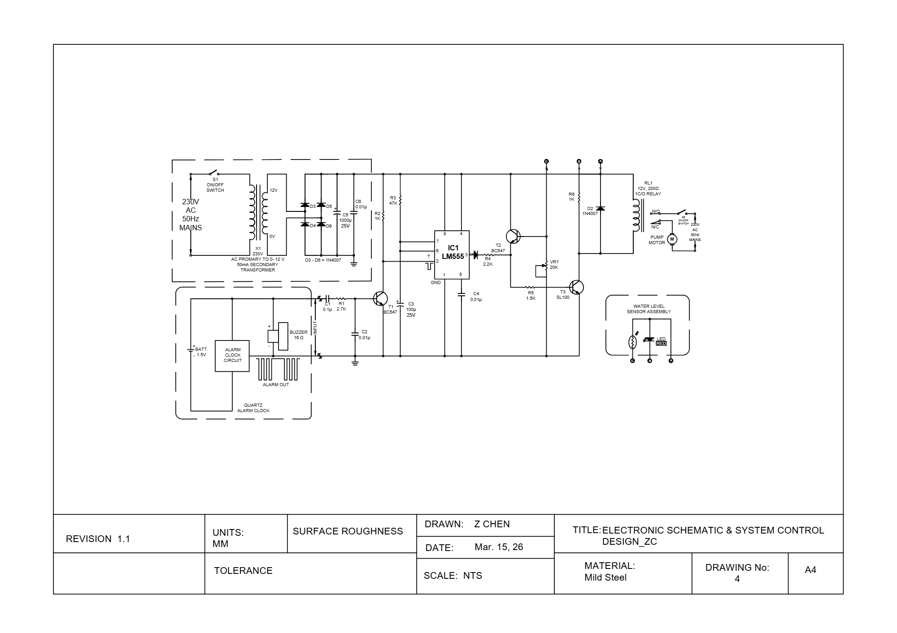
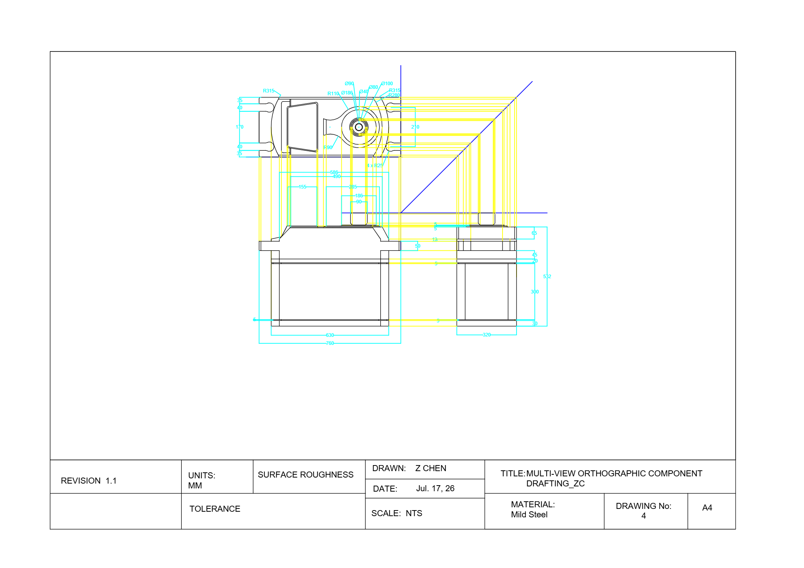
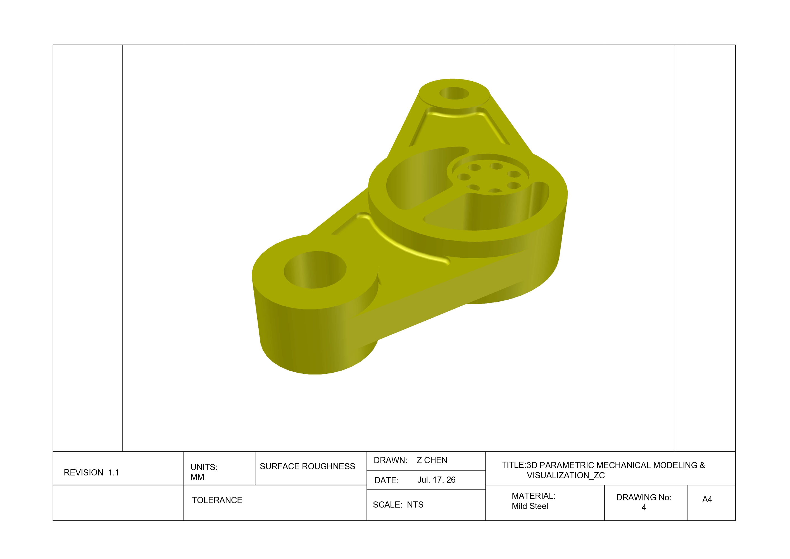
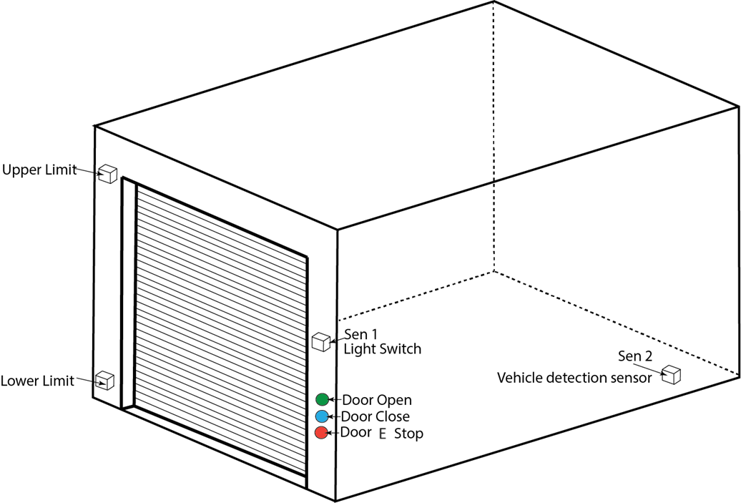
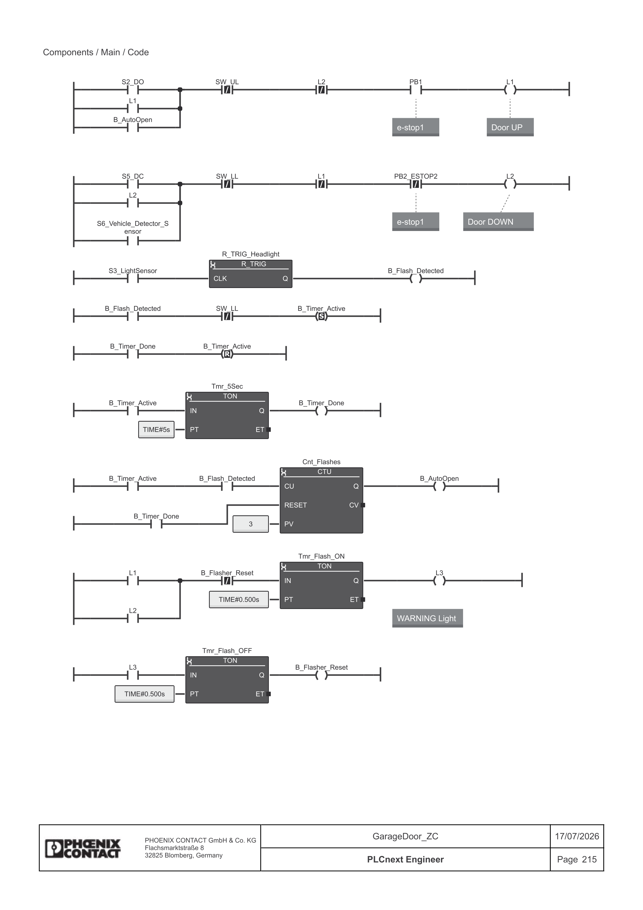
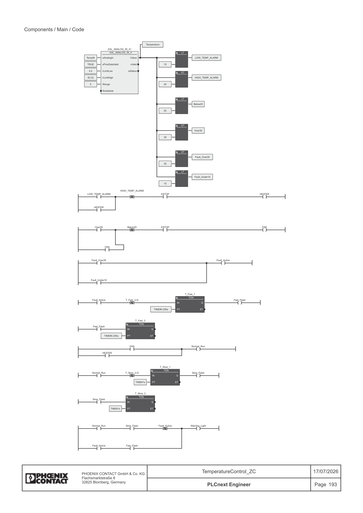

# AUTOCAD Drawings & PLC

# 🔌 Project 1: Electronic Schematic & System Control Design

**Status:** Completed | **Category:** Electrical Engineering | **Tech Stack:** AutoCAD Electrical, Circuit Simulation, Control Systems

### 📝 Overview

Designed a comprehensive, integrated control schematic for an automated industrial fluid pump system featuring hardware-level logic processing. The system integrates a regulated AC-to-DC power supply, a discrete 555-timer core for process control, acoustic/visual telemetry interfaces, and an electromechanical relay output stage to govern high-power mains equipment safely.

### 🛠 Key Features

- **Power Conditioning Subsystem:** Designed a complete linear power supply transforming $230\,\text{V}$ AC mains down to a smooth, rectified $12\,\text{V}$ DC bus using a step-down transformer, full-bridge rectifier ($1\text{N}4007$ diodes), and ripple-filtering electrolytic capacitors.
- **Timing & Control Core (`LM555`):** Integrated a highly stable `LM555` IC configuration to manage pulse generation and state-latching parameters based on sensor conditions.
- **Dual-Source Alarm Matrix:** Engineered a priority alarm input combining an autonomous quartz clock circuit (powered by an isolated $1.5\,\text{V}$ battery) with a transistor-driven $16\,\Omega$ buzzer network.
- **Heavy Load Switching (Galvanic Isolation):** Configured $12\,\text{V}$  single-pole double-throw (1C/O) electromechanical relay circuit isolated via a flyback diode ($1\text{N}4007$) to safely drive a  $230\,\text{V}$ AC industrial pump motor based on low-voltage sensor logic.

### 📂 Drawing Metadata Callout

- **Institution:** North Metropolitan TAFE
- **Material Specification:** Mild Steel Assembly Accoutrements
- **Scale:** Not to Scale (NTS) Schematic
    
    
    

<aside>
⬇️

[Click to Download Project 1 Drawing (.dwg)](https://github.com/Bazbyte/Robotics/blob/df8b34a107127541a52c3850758e5a4e5b062e89/AUTOCAD/Electronic%20Schematic%20%26%20System%20Control%20Design_ZC.dwg)

</aside>

# 📐 Project 2: Multi-View Orthographic Component Drafting

**Status:** Completed | **Category:** Mechanical Drafting | **Tech Stack:** Autodesk AutoCAD, Geometric Projection, Standardized Dimensioning

### 📝 Overview

Developed a highly complex, production-ready 2D multi-view orthographic drawing of a heavy industrial mechanical component. The asset translates true spatial features into three perfectly aligned projection planes (Top/Plan, Front, and Right-Side views) using strict geometric construction lines to ensure physical accuracy for manufacturing teams.

### 🛠 Key Features

- **Precision Orthographic Projection:** Leveraged standard $45^{\circ}$  miter-line projection planes to map spatial depths seamlessly between the plan view and side profiles.
- **Complex Fillet & Geometric Intersections:** Tracked and drawn precise concentric features, including varying radii ($R315$, $R280$, $R90$) and precise counterbore drill diameters (($\varnothing40$, $\varnothing80$, $\varnothing186$).
- **Standardized Layout & Clearance Control:** Configured exact component clearances, documenting key structural datums spanning from large overall footprints ($830\,\text{mm} \times 760\,\text{mm}$) down to tight structural steps ($5\,\text{mm}$, $6\,\text{mm}$, $12\,\text{mm}$).
- **Production-Ready Annotation Stack:** Implemented industry-standard extension lines, leaders, and distinct structural dimensions optimized for high legibility in a digital viewport environment.

<aside>
⬇️

[Click to Download Project 2 Drawing (.dwg)](https://github.com/Bazbyte/Robotics/blob/a6dc4e43faf161cc26f82496a72bffa6db6596e6/AUTOCAD/Multi-View%20Orthographic%20Component%20Drafting_ZC.dwg)

</aside>

# 📦 Project 3: 3D Parametric Mechanical Modeling & Visualization

**Status:** Completed | **Category:** 3D Modeling | **Tech Stack:** Autodesk AutoCAD 3D / Inventor, Solid Modeling, Digital Prototyping

### 📝 Overview

Transformed traditional 2D mechanical specifications into a fully realized 3D parametric solid model of a structural swing arm / rocker assembly. This project demonstrates the ability to interpret engineering blueprints, construct complex structural webs, and execute advanced 3D solid operations within a digital prototyping environment.

### 🛠 Key Features

- **Parametric Solid Modeling:** Extruded precise profile geometry, utilizing Boolean union and subtraction operations to create smooth bore intersections and unified structural brackets.
- **Weight Reduction & Web Construction:** Modeled an optimized central structural web featuring a large internal clearance radius alongside a circular mounting face populated with a precision-spaced, 8-hole circular bolt pattern.
- **Advanced Feature Blending:** Applied accurate 3D edge fillets and geometric drafts across the component transitions to reduce stress-concentration factors along load-bearing planes.
- **Render Presentation & Visual Verification:** Executed a high-fidelity shaded model layout to visually audit surface continuity, parting lines, and alignment before digital manufacturing validation.

<aside>
⬇️

[Click to Download The Project 3 Drawing (.dwg)](https://github.com/Bazbyte/Robotics/blob/99a96dfcde5d9d4f7b8a36a6271c357e5d00ea2b/AUTOCAD/3D%20Parametric%20Mechanical%20Modeling%20%26%20Visualization_ZC.dwg)

</aside>

---------------------------------------------------------------------------------------------------------------------------------------------------------------------------------
# 1. 🚗 Automated Garage Door Control System (PLC)

**Status:** Completed | **Category:** Industrial Automation & Systems Integration | **Tech Stack:** PLC Ladder Logic, Sensor Interlocking, Counter/Timer Logic
****

### **📝 Overview**

Engineered an automated control system for a residential or commercial garage door utilizing a Programmable Logic Controller (PLC). The system integrates intelligent vehicle detection, sequential control logic, and strict physical safety interlocks to manage automated entry/exit sequences alongside manual user overrides.

**🛠 Key Features**

- **Intelligent Vehicle Authentication (Pulse-Count Trigger):** Programmed advanced sensor telemetry via an exterior light switch sensor (`Sen 1`). The system detects a unique "keyless" credential—flashing high beams exactly 3 times within a rolling 5-second window—to initiate the door-open sequence.
- **Dual-Direction Safety Interlocking:** Designed robust mutual exclusion logic (electrical/software interlocks) ensuring the Door Opening Contactor and Door Closing Contactor can never be energized simultaneously, mitigating the risk of motor burnout or mechanical failure.
- **Automated Close-on-Entry Sequence:** Utilized an interior vehicle detection sensor (`Sen 2`) to identify when a vehicle has safely cleared the threshold, automatically triggering the closing contactor until the lower limit switch is engaged.
- **Manual Operator Stations:** Integrated momentary tactile control interface pushbuttons (Open, Close, and Emergency Stop) to allow manual operational override for users outside the vehicle.

### **💻 Technical Skills**

- **Advanced Logic Design:** High-frequency pulse counting, time-window constraints, and latching/unlatching control circuits.
- **System Protection:** Interlocking state machines and limit-switch end-travel isolation.
- **Hardware Mapping:** Integration of photoelectric retroreflective sensors, mechanical limit switches, and motor contactors.

### **📂 System Component & I/O MappingTag NameDevice TypeFunction**

| **Tag Name** | **Device Type** | **Function Description** |
| --- | --- | --- |
| `I_Upper_Limit` | Input (NC/NO Switch) | Detects fully open door state; cuts opening contactor power |
| `I_Lower_Limit` | Input (NC/NO Switch) | Detects fully closed door state; cuts closing contactor power |
| `I_Sen_1` | Input (Photoelectric) | External light sensor; counts headlight pulses (3 pulses / 5s) |
| `I_Sen_2` | Input (Proximity/Loop) | Internal vehicle detection sensor; triggers auto-close |
| `I_PB_Open` | Input (Momentary NO) | External green pushbutton; initiates manual opening sequence |
| `I_PB_Close` | Input (Momentary NO) | External blue pushbutton; initiates manual closing sequence |
| `O_Contactor_Open` | Output (Actuator) | Drives motor upward (Interlocked against Closing output) |
| `O_Contactor_Close` | Output (Actuator) | Drives motor downward (Interlocked against Opening output) |

### 💡 Engineering Approach

- **Time-Bounded Pulse Counting:** The headlight trigger utilizes a fast-acting upward counter coupled with a non-retentive off-delay timer (5s). If 3 pulses are not recorded within the time envelope, the counter resets automatically, filtering out environmental noise or random light fluctuations.
- **Fail-Safe Interlocking Architecture:** To absolute-proof the motor contactors against cross-conduction, the software passes the activation coil of each direction through the Normally Closed (NC) auxiliary contacts/bits of the opposing direction.

### 📄 [**Click to View Ladder Logic & HMI Configuration (PDF)**](https://github.com/Bazbyte/Robotics/blob/main/PLC/Garage%20Door%20Control_ZC.pdf)

### 📥 [**Click to Download PLC Source Archive (.pcwex)**](https://github.com/Bazbyte/Robotics/blob/977ecc580e18a022490b780ad2c1edc0b48fc8f6/PLC/GarageDoor_ZC.pcwex)

# 2. 🌡️ Automated Temperature Control System (PLC)

**Status:** Completed | **Category:** Industrial Automation | **Tech Stack:** PLC Ladder Logic, Analog Sensor Integration

### 📝 Overview

Developed a robust Programmable Logic Controller (PLC) application designed to monitor ambient conditions and execute automated temperature regulation. The system manages dual-stage climate control via a closed-loop feedback mechanism, integrating analog sensor scaling, digital output control, and an intelligent, multi-state fault detection and alarm system.

### 🛠 Key Features

- **Analog Data Scaling:** Processed raw analog signals from a temperature sensor into calibrated engineering units (°C).
- **Dual-Stage Climate Control:** Implemented hysteresis logic to prevent actuator "chattering":
    - **Fan:** Activation at > 30°C | Deactivation at < 25°C.
    - **Heater:** Activation at < 15°C | Deactivation at > 20°C.
- **Intelligent Visual Telemetry:** Single-output visual warnings using PLC timers:
    - **Operational Status:** 2-second interval flash when active.
    - **Fault/Critical State:** 0.5-second fast flash when < 10°C or > 35°C.
- **Safety Interlocks:** Dedicated buzzer alarm output for critical temperature breach events.

### 💻 Technical Skills

- **Programming Logic:** Ladder Logic design, Hysteresis, Signal Scaling, Timer/Counter programming.
- **Diagnostic Design:** Fault detection logic and critical safety alarm systems.
- **Hardware Interaction:** Sensor integration, Relay control, Digital I/O management.

### 📂 Implementation Highlights

| Logic Type | Logic Condition | Actuator State |
| --- | --- | --- |
| **Cooling** | Temp > 30°C | ON |
| **Cooling** | Temp < 25°C | OFF |
| **Heating** | Temp < 15°C | ON |
| **Heating** | Temp > 20°C | OFF |
| **Alarm** | Temp < 10°C or > 35°C | High-Frequency Flash + Buzzer |

### 💡 Engineering Approach

- **Hysteresis Implementation:** By creating a "gap" between activation and deactivation temperatures, the system preserves actuator longevity by avoiding unnecessary rapid cycling near the threshold.
- **Diagnostic Efficiency:** Utilized a single digital output channel to signal multiple machine states (Normal vs. Fault) by leveraging time-frequency modulation rather than consuming additional I/O hardware.

### 📄 [**Click to View Ladder Logic & HMI Configuration (PDF)**](https://github.com/Bazbyte/Robotics/blob/main/PLC/Temperature%20Control_ZC.pdf)

### 📥 [**Click to Download PLC Source Archive (.pcwex)**](https://github.com/Bazbyte/Robotics/blob/main/PLC/TemperatureControl_ZC.pcwex)
